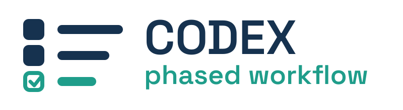
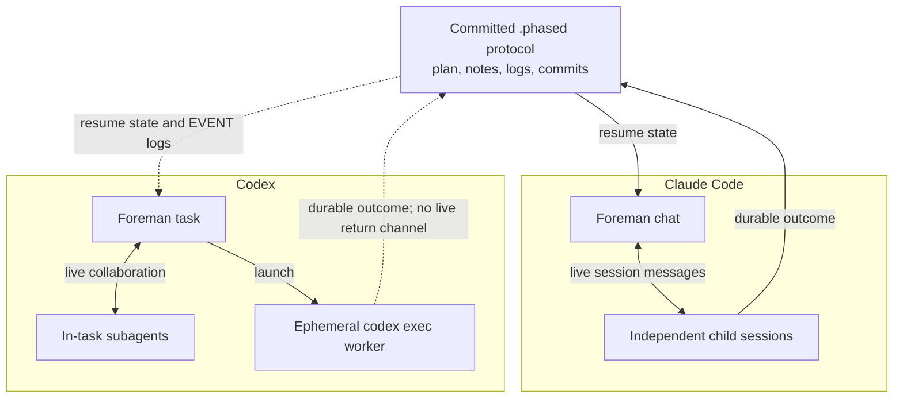

# Codex Phased Workflow



A Codex-native phased development workflow that can take over work started by
[`claude-phased-workflow`](https://github.com/fporcari/claude-phased-workflow)
and hand it back without conversion.

The plugin turns a conversation into a committed plan, executes one bounded
phase at a time, records machine-readable outcomes, repairs failures in fresh
contexts, and consolidates the workflow only after a whole-diff quality gate.

## Interoperability first

`.phased/` is a product-neutral protocol. Both implementations share:

- `.phased/active/<slug>/plan.md`, notes, verification, mockups, tests, and logs;
- phase states `[ ]`, `[>]`, `[x]`, `[!]`, and `[~]`;
- optional `Channel: in-chat|relayed` routing and planned `Batches:` notes;
- note fields such as `Done`, `Files`, `Issue`, `Attempted`, `Applied`, `Repaired`, and `Blocked`;
- `wf/<slug>` branches, a plan-first commit, one closing commit per phase, and optional batch/checkpoint partials;
- portable `opus`/`fable` model labels in plans.

Codex maps all code-writing labels, including legacy `sonnet`, to
`gpt-5.6-sol`. The label stays unchanged on disk so Claude can resume the same
plan. See [the protocol contract](docs/PROTOCOL.md).

## Claude Code and Codex architecture

The workflow semantics are the same; the runtime coordination is not.



| Concern | Claude implementation | Codex implementation | Compatibility consequence |
|---|---|---|---|
| Interactive supervisor | A foreman chat | A foreman task | Same ownership recorded in `foreman.json` |
| Interactive in-chat channel | One attended conversation carries planning, phases, and gates | The same conversation carries planning, phases, and gates | No relay and no `foreman.json`; decisions still land in `notes.md` |
| Workers inside one runtime tree | Child agents/sessions can exchange live messages | Codex subagents can exchange live messages with their parent task | Progress can be relayed immediately |
| Autonomous phase isolation | Fresh `claude -p` session per phase | Fresh ephemeral `codex exec` session per phase | Both start with clean context |
| Foreman ↔ autonomous worker dialogue | Claude session tools can provide a live return channel when available | Separate `codex exec` processes do not currently expose a portable live channel back to the app task | Codex uses committed markers, notes, logs, and `EVENT:` lines as the authoritative return path |
| Model selection | Portable `opus`/`fable`; legacy `sonnet` accepted | Every code-writing, repair, and review worker uses `gpt-5.6-sol`; effort varies | Model labels remain unchanged on disk |
| Autonomous permissions | Claude auto permission mode | Codex `workspace-write` with no automatic escalation approval | Out-of-scope operations fail and return to the foreman |
| Independent judges | Claude agent manifests | Fixed judge prompts dispatched to fresh Codex subagents | Same fresh-eyes review semantics, different packaging |
| Plugin-relative paths | Claude plugin-root environment | Codex resolves the plugin directory from the loaded skill path | Runtime paths never enter `.phased/` |
| Workflow workspace | Claude may provision a host-specific worktree during planning | Codex uses the checkout or worktree selected when the task is created | Workspace provisioning never enters the portable protocol |
| Notifications | Product/session notification facilities when available | Sparse `EVENT:` output plus task notifications when available | Notification failure never changes workflow state |

### Known coordination gap

An ephemeral CLI worker does not address the desktop foreman directly. The
launcher holds a plan-defect claim on an owner-private file return leg while
the supervising task is live. The hold has no default deadline; an explicit
timeout may hand the claim to fresh repair. Every outcome still lands first as a marker, structured notes,
log, and commit. This is what makes a handoff across products or machines
reliable.

Within one Codex task, ordinary subagents still communicate live. A future
optional relay can add live dialogue for independent `codex exec` workers, but
it must remain an acceleration over the file-backed protocol, never a new source
of truth.

## Install

```bash
codex plugin marketplace add fporcari/codex-phased-workflow
codex plugin add codex-phased-workflow@codex-phased-workflow
```

Restart Codex after installation. The plugin exposes planning, execution,
resume, repair, quality-check, finalization, issue, and pull-request skills.
The optional `dashboard` skill opens an authenticated localhost view that reads
the same state and queues proposals back to its owning Codex task; it is never a
workflow precondition. See [the wfdash guide](docs/wfdash.md).
See [the colleague installation guide](docs/INSTALL.md) for first install,
updates, verification, and Claude handoff instructions.

## Typical flow

1. `scope-workflow` for a decision-heavy idea, or start from a clear request.
2. `write-workflow` chooses mode and channel, creates the branch, and commits `.phased/`.
3. `execute-phase` runs one interactive phase, or `run-workflow` launches a
   fresh Sol session for each autonomous phase.
4. `quality-check` reviews the complete result.
5. `finalize-workflow` archives the plan and proposes the final consolidation.

At any point, open the same repository in Claude Code and run its
`resume-workflow`; the inverse handoff works the same way.

For a release-by-release account of the Claude baseline and each Codex-native
adaptation, see [the parity inventory](docs/PARITY.md).

## Safety and quality

- Autonomous workers use Codex `workspace-write` without automatic escalation approval, never a
  sandbox bypass.
- Code-writing, repair, and review use `gpt-5.6-sol`; only effort varies.
- External effects such as merges, deploys, publication, and destructive
  cleanup remain outside autonomous authority.
- Every plugin skill and manifest is validated in CI, alongside protocol
  fixtures originating from both runtimes, launcher interruption/consult/stop
  scenarios, dashboard concurrency and ownership, and its HTTP perimeter.

## Development

```bash
./tests/run_tests.sh
python3 ~/.codex/skills/.system/plugin-creator/scripts/validate_plugin.py \
  plugins/codex-phased-workflow
```

MIT licensed.
